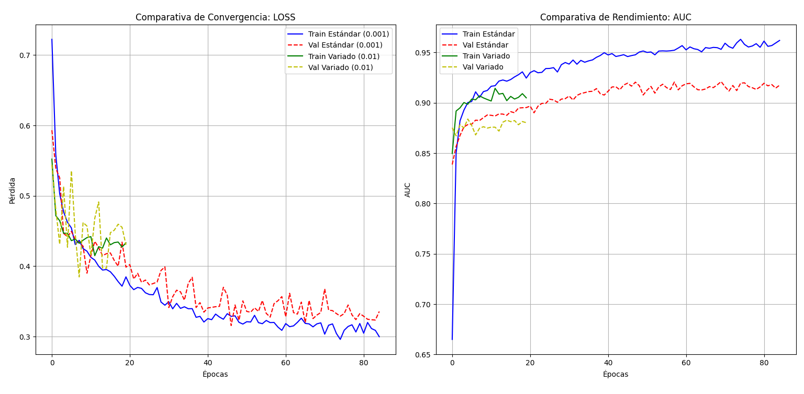
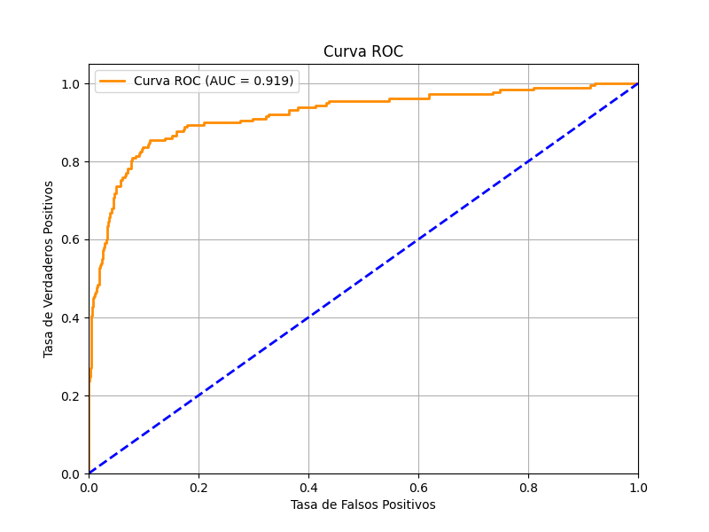
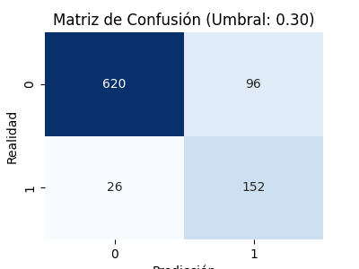

# Credit Risk MLP

**Binary default prediction on home equity loans using a Multilayer Perceptron on HMEQ**

Academic project · Centro EUSA, Sevilla · 2025–2026

---

## Overview

In banking, the cost of credit risk errors is asymmetric: missing a defaulting customer (false negative) means losing the full loan principal — a catastrophic outcome — while incorrectly rejecting a solvent customer (false positive) means losing interest income, a bounded and recoverable loss. This project builds a **conservative, defensive classifier** that prioritises recall over precision, explicitly designed to minimise false negatives at the cost of some false positives.

Under the EU AI Act (Regulation 2024/1689), credit scoring systems based on neural networks are classified as **high-risk AI**, requiring strict transparency, explainability, and auditability standards for real deployment.

**Task:** Given a home equity loan applicant's financial profile, predict whether they will default (`BAD = 1`) or remain solvent (`BAD = 0`).

**Result (threshold = 0.30):** AUC = **0.9195** · Recall (defaulters) = **85.4%** · Precision (defaulters) = **61.3%** · FN = 26 · Accuracy = **86%**

---

## Repository structure

```
credit-risk-mlp/
├── mlp_riesgo_de_crédito.py    — full pipeline: EDA, preprocessing, training, evaluation
├── mejor_modelo_hmeq.keras     — best model (lr = 0.001, epoch 70, AUC = 0.921)
├── modelo_LR_variado_hmeq.keras — comparison model (lr = 0.01, epoch 5, AUC = 0.884)
├── hmeq.csv                    — local dataset copy (fallback if URL is unavailable)
├── requirements.txt
└── figures/
    ├── distribucion_de_variables.png
    ├── matriz_de_correlacion.png
    ├── comparativa_de_convergencia_y_rendimiento.png
    ├── curva_ROC.png
    ├── matriz_umbral_0,3.png
    ├── matriz_umbral_0,5.png
    └── matriz_umbral_0,7.png
```

---

## Dataset

**HMEQ (Home Equity)** — 5,960 home equity loan records.

The script downloads the dataset automatically from `http://www.creditriskanalytics.net`. A local copy (`hmeq.csv`) is included as a fallback in case the URL becomes unavailable.

**Target variable:** `BAD` — 1 if the customer defaulted or had serious delinquencies, 0 if solvent.
**Class distribution:** Solvent 80% · Defaulter 20% — significant imbalance.

| Variable | Type | Description |
|---|---|---|
| LOAN | Continuous | Loan amount requested (USD) |
| MORTDUE | Continuous | Amount owed on existing mortgage |
| VALUE | Continuous | Current property value |
| REASON | Categorical | Loan purpose (DebtCon / HomeImp) |
| JOB | Categorical | Occupation category (6 classes) |
| YOJ | Continuous | Years at current job |
| DEROG | Discrete | Number of major derogatory reports |
| DELINQ | Discrete | Number of delinquent credit lines |
| CLAGE | Continuous | Age of oldest credit line (months) |
| NINQ | Discrete | Recent credit inquiries |
| CLNO | Discrete | Total number of credit lines |
| DEBTINC | Continuous | Debt-to-income ratio (highest null rate: 1,267 / 5,960) |

**Key preprocessing decisions:**

- **Feature engineering before split** — three synthetic features created before the train/val/test split to avoid data leakage:
  - `LTV` (Loan-to-Value = `LOAN / VALUE`): risk of the loan relative to the collateral.
  - `EQUITY` = `VALUE - MORTDUE`: available equity before taking the new loan.
  - `DEBTINC_MISSING`: binary flag indicating imputed values in `DEBTINC`.
- **Three-pipeline preprocessing** via `ColumnTransformer`:
  - Financial variables (`LOAN`, `MORTDUE`, `VALUE`, `LTV`, `EQUITY`, `DEBTINC`): median imputation → log1p transform → StandardScaler.
  - Ordinal numerics (`YOJ`, `CLAGE`, `CLNO`, `NINQ`, `DEROG`, `DELINQ`): median imputation → StandardScaler.
  - Categorical (`REASON`, `JOB`): mode imputation → OneHotEncoder. No ordinal encoding — neural networks should not assume order.
- **Stratified 70 / 15 / 15 split** to preserve class proportions across all sets.
- **Safety post-processing:** `np.nan_to_num` eliminates inf/nan values that may appear after log-transforming negative LTV values (possible when LOAN > VALUE). This is expected behaviour, not a bug.
- **Final tensor shape: (21,)** — 6 log-scaled + 6 ordinal-scaled + 8 one-hot + 1 binary flag.

---

## Model

**MLP — inverse pyramid topology (64 → 32 → 16 → 1)**

| Layer | Neurons | Activation | Regularisation |
|---|---:|---|---|
| Dense 1 | 64 | ReLU | L2 (0.001) + Dropout 30% |
| Dense 2 | 32 | ReLU | L2 (0.001) + Dropout 20% |
| Dense 3 | 16 | ReLU | L2 (0.001) |
| Output | 1 | Sigmoid | Bias initialised to logit(P(BAD=1)) |

**Total trainable parameters: 4,033**

Key design decisions:
- **Inverse pyramid (64→32→16):** progressive compression forces the network to distil the most relevant patterns. Starting width of 64 matches double the batch size, a common heuristic.
- **Sigmoid output with logit bias initialiser:** the bias is set to `log(positives/negatives)` = `log(0.20/0.80)` from the first epoch, so the model starts aware that the base rate of default is 20%, not 50%. This speeds up convergence under class imbalance.
- **Class weights:** proportional to inverse class frequency, applied during training to further compensate for the 80/20 imbalance.
- **AUC as early stopping monitor** instead of accuracy — with a 20% positive class, accuracy is misleading (a model predicting always 0 achieves 80% accuracy). AUC measures the model's ability to discriminate between classes regardless of threshold.

### Two-model comparison

The project trains two identical architectures with different learning rates to study convergence behaviour:

| Model | LR | Stopped at | Best epoch | Best val AUC |
|---|---|---:|---:|---:|
| `modelo_LR_variado_hmeq.keras` | 0.01 | epoch 20 | epoch 5 | 0.884 |
| `mejor_modelo_hmeq.keras` | 0.001 | epoch 85 | epoch 70 | 0.921 |

LR = 0.01 converges faster but plateaus early and shows more instability. LR = 0.001 takes longer but reaches a significantly better AUC. `mejor_modelo_hmeq.keras` is the model used for final evaluation.



---

## Results

### ROC curve

**AUC (test) = 0.9195**



### Threshold analysis

Three thresholds were evaluated. The chosen threshold is **0.30**.

| Threshold | TP | FN | FP | TN | Recall | Precision |
|---:|---:|---:|---:|---:|---:|---:|
| 0.50 | 142 | 36 | 56 | 660 | 79.8% | 71.7% |
| **0.30** | **152** | **26** | **96** | **620** | **85.4%** | **61.3%** |
| 0.70 | 128 | 50 | 34 | 682 | 71.9% | 79.0% |

Threshold 0.30 was selected because it minimises false negatives (26 vs 36 at 0.50) — the critical error in a banking context. The trade-off is accepting more false positives (96 vs 56), which means rejecting some solvent customers. In practice, this means the bank protects its capital at the cost of some missed lending opportunities.



### Final classification report (threshold = 0.30)

| Class | Precision | Recall | F1 |
|---|---:|---:|---:|
| Solvent (0) | 0.96 | 0.87 | 0.91 |
| Defaulter (1) | 0.61 | 0.85 | 0.71 |
| **Accuracy** | | | **0.86** |

The model detects 85% of defaulters before they fail to repay. 15% of defaulters (26 customers) would still receive credit — a residual risk that would need to be managed through loan-level controls in a real deployment.

---

## How to run

```bash
pip install -r requirements.txt

# The script downloads the dataset automatically on first run.
# hmeq.csv is included as a fallback if the URL is unavailable.
python mlp_riesgo_de_crédito.py
```

> **Note:** The script uses `plt.show()` for interactive visualisation. Figures are saved to `figures/` automatically.

---

## Limitations

- **Precision trade-off.** At threshold 0.30, 40% of flagged customers are actually solvent. A bank using this model would reject legitimate loan applications at a non-trivial rate, with reputational and legal implications.
- **Black-box model.** The MLP provides no feature-level explanation for individual predictions. Under the AI Act, real deployment would require post-hoc explainability (e.g. SHAP) to audit for discriminatory patterns in protected variables (age, gender proxies, employment type).
- **Dataset size.** 5,960 records is small for a financial risk model. Generalisation to a different loan portfolio or economic cycle is not guaranteed.
- **Static threshold.** The optimal threshold was chosen on test data under current class distribution. If the default rate shifts, the threshold would need recalibration.

---

## Academic context

Individual project · Centro EUSA, Sevilla · 2025–2026

Dataset: HMEQ — available at [creditriskanalytics.net](http://www.creditriskanalytics.net) (public domain for educational use).
