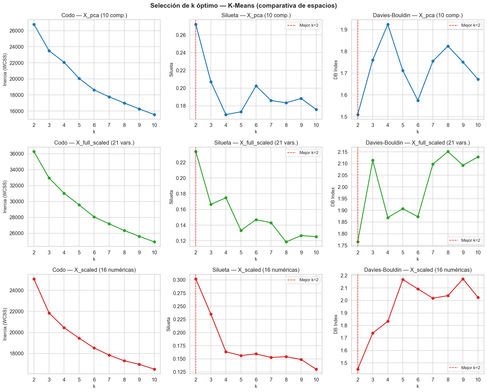
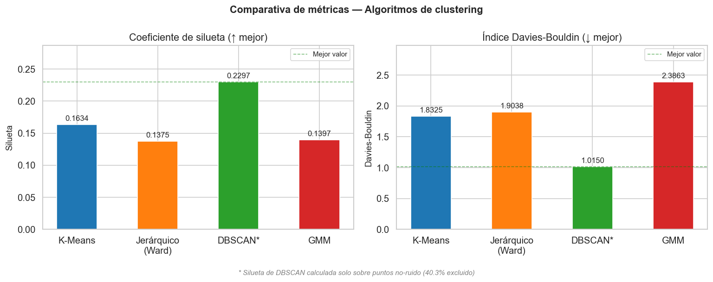
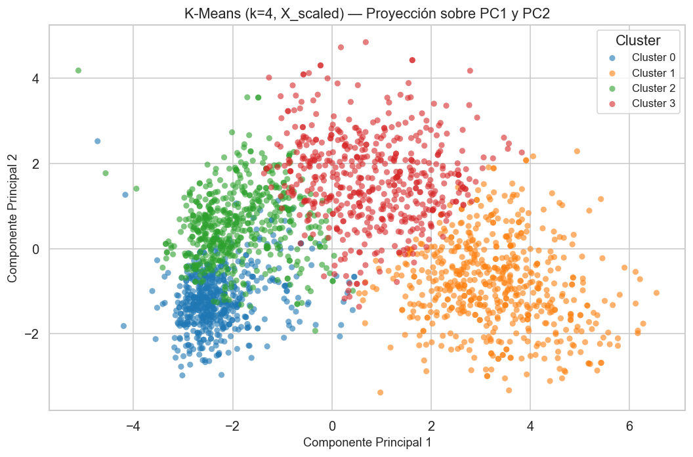
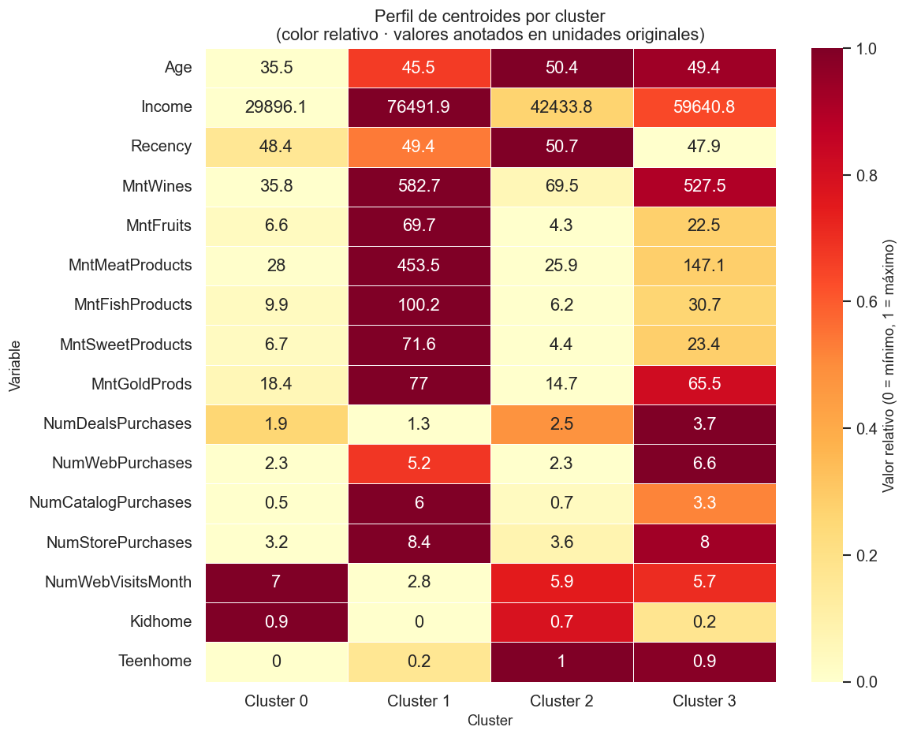

# Customer Segmentation — Clustering Comparative

**Comparative analysis of K-Means, Hierarchical, DBSCAN, and GMM clustering for marketing segmentation**

Academic project · Centro EUSA, Sevilla · 2025–2026

---

## Overview

Not all customers are alike — and treating them as such means wasted marketing budget and missed opportunities. This project segments customers from a marketing campaign dataset using four unsupervised learning algorithms, evaluates them with both quantitative metrics and business-level reasoning, and produces a concrete recommendation for monthly production use.

The key finding: **DBSCAN appears to win on metrics but is actually the worst choice for this use case** — a result that demonstrates why algorithmic metrics alone are insufficient to evaluate clustering in a business context.

**Task:** Segment 2,240 customers into actionable groups based on demographic data, purchasing behaviour, and campaign responses, using K-Means, Hierarchical (Ward), DBSCAN, and GMM.

**Recommended algorithm:** K-Means with k=4

---

## Repository structure

```
customer-segmentation-clustering/
├── clustering_practica.ipynb   — full pipeline: EDA, preprocessing, all 4 algorithms, comparison
├── marketing_campaign.csv      — dataset (2,240 customers, included in the repository)
├── requirements.txt
└── figures/
    ├── analisis_de_componentes_principales.png
    ├── coeficiente_de_silueta.png
    ├── comparativa_de_metricas_por_algoritmo.png
    ├── curvas_k-distance_por_min_samples.png
    ├── DBSCAN.png
    ├── dendograma.png
    ├── K-Means.png
    ├── perfil_de_centroides_por_cluster.png
    └── seleccion_de_k_optimo.png
```

---

## Dataset

**Marketing Campaign** — 2,240 customer records from a retail company's CRM.

The dataset is included directly in the repository (`marketing_campaign.csv`). Original source: [Kaggle — Marketing Campaign](https://www.kaggle.com/datasets/rodsaldanha/arketing-campaign).

The dataset contains demographic information (age, income, education, marital status, number of children), purchasing behaviour (spend on wine, meat, fish, sweets, gold, catalogue orders, web purchases, store visits), and responses to 5 previous marketing campaigns.

**Preprocessing decisions:**

- `Income`: 24 missing values imputed with the median (robust to the right-skewed income distribution).
- `Age`: derived from `Year_Birth` using reference year 2014 (approximate data collection year). Three records with Age > 90 imputed with the median.
- **Excluded variables:** `ID` (identifier), `Dt_Customer` (date string), `AcceptedCmp1-5` and `Response` (campaign outcomes — not descriptors of baseline behaviour), `Complain` (low-signal binary event), `Z_CostContact` and `Z_Revenue` (constants).
- **Selected features (15):** `Age`, `Income`, `Kidhome`, `Teenhome`, `Recency`, `MntWines`, `MntFruits`, `MntMeatProducts`, `MntFishProducts`, `MntSweetProducts`, `MntGoldProds`, `NumDealsPurchases`, `NumWebPurchases`, `NumCatalogPurchases`, `NumStorePurchases`.
- **Dimensionality reduction:** PCA retaining 85% of explained variance, producing 7 components. Input to all clustering algorithms is the PCA-transformed, standardised feature matrix.

---

## Algorithms and results

### Selection of optimal k

The elbow method and silhouette analysis consistently point to **k = 4** as the optimal number of clusters. The elbow shows a clear inflection at k=4; silhouette peaks there before degrading. All partition-based algorithms (K-Means, Hierarchical, GMM) use k=4.



### Quantitative comparison

| Algorithm | Silhouette | Davies-Bouldin | Clusters | Noise |
|---|---:|---:|---:|---:|
| K-Means | 0.1634 | 1.8325 | 4 | N/A |
| Hierarchical (Ward) | 0.1375 | 1.9038 | 4 | N/A |
| DBSCAN* | 0.2297 | 1.0150 | 2 | 40.3% |
| GMM | 0.1397 | 2.3863 | 4 | N/A |

*DBSCAN silhouette and DB calculated only on non-noise points (59.7% of dataset).



### Why DBSCAN's metrics are misleading

DBSCAN appears to win on both metrics. It doesn't — its scores are inflated by two compounding biases:

**1. Excluding 40.3% of the data.** Silhouette and Davies-Bouldin are calculated only on the 1,337 non-noise points. The 903 customers classified as noise — precisely the hardest to classify — are excluded. K-Means and GMM include all points.

**2. Degenerate 2-cluster solution.** DBSCAN produces one macro-cluster with ~95% of non-noise customers and one tiny cluster of extreme outliers. The silhouette is high because outliers are far from the macro-cluster, not because genuinely differentiated segments exist. In business terms, a segmentation where one cluster contains 95%+ of customers is not actionable for differentiated marketing campaigns.

### K-Means segmentation



### Cluster profiles (business interpretation)

| Cluster | Name | Key characteristics |
|---|---|---|
| 0 | Familias jóvenes de bajo presupuesto | Clientes en fase de formación de familia con restricciones 
presupuestarias claras. El gasto se destina a necesidades básicas, no a productos 
premium ni compras por catálogo |
| 1 | Compradores premium de alto poder adquisitivo | Cliente de alto valor económico, fidelizado y poco sensible 
al precio. Valora la calidad y la variedad; compra por todos los canales disponibles |
| 2 | Familias con adolescentes de renta media-baja | Familias en fase de hijos adolescentes con presupuesto ajustado. 
Buscan activamente ofertas y descuentos. Son fieles a la tienda física pero 
consultan la web para comparar precios antes de comprar |
| 3 | Compradores activos de renta media-alta | Cliente con capacidad económica que aun así maximiza el valor 
de sus compras buscando descuentos. Es el perfil más activo digitalmente y más 
receptivo a ofertas multicanal. Combina gasto alto con comportamiento de "smart shopper" |

K-Means produces 4 balanced, interpretable segments. Centroid profiles (after inverse-transforming the PCA and scaler) reveal distinct customer archetypes:



The segments can be interpreted in business terms directly from centroid values — e.g. "Cluster 0 spends 583€ on wine and has income 76,500€" is an actionable description that a marketing team can use without statistical expertise.

---

## Recommendation for monthly production use

**K-Means is the recommended algorithm** for a recurrent monthly segmentation pipeline, for four reasons:

**Interpretability.** Centroids are directly readable in original units after inverse-transforming. No statistical background required to validate segments.

**Stability.** With fixed `random_state=42` and `n_init=10`, K-Means produces identical results on every run. A monthly pipeline needs "Cluster 1 premium" to mean the same customer profile in February as in January, so campaign impact can be measured across months.

**Scalability.** K-Means scales linearly with observations. GMM is more expensive (iterative EM). Hierarchical clustering requires O(n²) memory and cannot classify new customers without rebuilding the full dendrogram.

**Classifying new customers without retraining.** `model.predict()` on the saved scaler + KMeans object classifies new customers instantly, without retraining. This is essential for a live pipeline.

**When to consider alternatives:**
- **Hierarchical (Ward):** for initial exploration or when k is unknown. The dendrogram adds analytical value. Not recommended for production.
- **DBSCAN:** if the goal shifts to anomaly detection (fraud, extreme VIP behaviour) rather than mass segmentation. In that case, noise points are the result of interest.
- **GMM:** if the business needs membership probabilities for high-cost decisions, or if clusters have strongly different elliptical shapes.

---

## How to run

```bash
pip install -r requirements.txt
```

> **Note on paths:** `DATA_PATH` in the configuration cell (Cell 1) contains an absolute Windows path. Update it to point to your local copy of `marketing_campaign.csv` before running. The dataset is included in the repository root.

Open `clustering_practica.ipynb` in Jupyter, VS Code, or Google Colab and run all cells sequentially. Figures are generated inline and can be exported manually from the notebook.

---

## Limitations

- **Low silhouette scores.** All partition-based algorithms score between 0.13 and 0.16. This reflects genuine overlap between customer segments — marketing data rarely produces well-separated clusters. The segments are interpretable and business-useful even if not geometrically compact.
- **PCA information loss.** Reducing to 7 components captures 85% of variance but discards 15%. Some nuanced customer differences may be lost in the transformation.
- **Static segmentation.** The model was trained on a fixed snapshot. Customer behaviour evolves; monthly retraining is recommended to keep segments current.
- **No ground truth.** Without labelled segments, it is impossible to objectively verify that the clusters map to real customer archetypes. Business validation by the marketing team is essential before acting on the segmentation.

---

## Academic context

Individual project · Centro EUSA, Sevilla · 2025–2026

Dataset: Marketing Campaign — [Kaggle](https://www.kaggle.com/datasets/rodsaldanha/arketing-campaign) (public domain for educational use).
