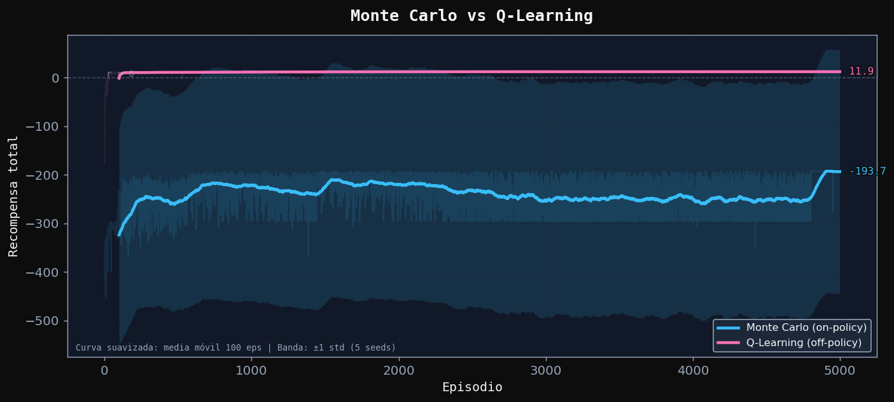

# Donkey Kong Inverso — Monte Carlo vs Q-Learning

**Comparative study of tabular reinforcement learning algorithms on a custom grid-world environment**

Academic project · Centro EUSA, Sevilla · 2025–2026 · Team project

---

## Overview

Reinforcement learning algorithms differ not just in their convergence speed but in their fundamental assumptions about the world: Monte Carlo waits until the end of an episode to learn, while Q-Learning updates at every step. This project implements both on a custom Donkey Kong-inspired 6×6 grid world and answers five concrete questions about convergence, solution quality, exploration, robustness to noise, and policy structure.

**Key finding:** Q-Learning converges consistently across all 5 seeds in 5,000 episodes. Monte Carlo converges in only 3 out of 5 seeds even with 20,000 episodes — a structural consequence of its episode-complete update mechanism, not a bug.

**Both algorithms find the same optimal 9-step policy when they converge.**

---

## Authorship

This is a two-person team project. The notebook is structured so each algorithm is implemented and analysed by a different author:

| Component | Author |
|---|---|
| Monte Carlo on-policy (ε-greedy) | Miguel J. Gutiérrez |
| Q-Learning off-policy (TD) | Adrián Pavón |
| Environment design, analysis questions, visualisation system | Shared |

**This repository contains the full collaborative notebook.** Both implementations are included because they are designed to be compared side by side — separating them would remove the comparative value of the project.

---

## Repository structure

```
donkey-kong-rl/
├── Donkey_Kong_Inverso.ipynb   — full notebook: environment, MC, Q-Learning, analysis
├── Logs_DK.txt                 — training output logs with all numerical results
├── requirements.txt
└── figures/
    ├── mapa_del_entorno.png
    ├── estructura_de_curvas.png
    ├── exploracion_con_politica_aleatoria.png
    ├── Monte_Carlo_vs_Q-Learning.png
    ├── Monte_Carlo_politica_greedy.png
    ├── Monte_Carlo_politica_greedy_aprendida.png
    ├── MC_impacto_del_decaimiento_de_ɛ.png
    ├── MC_vs_QL_entorno_estocastico.png
    └── Q-Learning_politica_greedy.png
```

---

## Environment

**DonkeyKongInverso** — custom 6×6 grid world implemented from scratch.

```
     0    1    2    3    4    5
   ────────────────────────
 0 │ S  .  L  .  .  .
 1 │ .  L  .  .  L  .
 2 │ .  H  .  H  .  L
 3 │ L  .  .  L  .  .
 4 │ .  .  L  .  .  L
 5 │ .  L  .  L  .  G

S = Start (0,0)   G = Goal (5,5)   H = Hole   L = Ladder
```

**Movement rules:**
- Actions: up, down, left, right (4 discrete actions).
- Vertical movement only works from a ladder cell — otherwise the action costs -1 with no displacement.
- Ladders teleport the agent between specific cell pairs (e.g. `(0,2)↔(3,0)`, `(3,3)↔(5,3)`).

**Rewards:** Goal = +20 (done) · Hole = -1 (done) · Any step = -1.

**Two environment variants:** deterministic and stochastic (10% slip probability — action is ignored with p=0.10, agent stays in place and still pays -1).

---

## Algorithms

### Monte Carlo (on-policy, ε-greedy) — Miguel J. Gutiérrez

Every-visit MC: the Q-table is updated only at the **end of the episode**, using the full discounted return G propagated backwards through the trajectory. This means the agent receives no learning signal from incomplete episodes, which is the root cause of MC's convergence instability in this environment.

**Configuration:** 5,000 episodes (standard) / 20,000 episodes (extended run), γ = 0.99, ε start = 0.20, ε end = 0.01, ε decay = 0.999.

### Q-Learning (off-policy, TD) — Adrián Pavón

Q-Learning updates the Q-table at **every step** using bootstrapping — it uses the current estimate of the next state's value without waiting for the episode to end. This makes it significantly more sample-efficient in environments where reaching the goal by chance is rare.

**Configuration:** 5,000 episodes, γ = 0.99, α = 0.10, same ε schedule as MC.

---

## Results

### Baseline: random policy

A random policy reaches the goal in 7/20 episodes (35%), with a mean reward of -173.35 and frequent timeouts (>200 steps). This establishes the lower bound both algorithms must clearly surpass.

### Deterministic environment (5,000 episodes, 5 seeds)

| Metric (last 500 episodes) | Monte Carlo | Q-Learning |
|---|---:|---:|
| Mean reward | 5.20 | 11.92 |
| Success rate | 78.0% | **100.0%** |
| Mean steps (successful) | 14.3 | **9.1** |

Q-Learning converges in **all 5 seeds**. Monte Carlo converges in only **2 out of 5** (seeds 99 and 2025). In seeds 42 and 13, MC never escapes the -500 reward plateau even with 20,000 episodes.



**Optimal policy (both algorithms, where MC converges):**
`(0,0) → (0,1) → (0,2) → (3,0) → (3,1) → (3,2) → (3,3) → (5,3) → (5,4) → (5,5)` — **9 steps**.
The agent moves right to the first ladder at `(0,2)`, descends to `(3,0)`, crosses row 3 to the second ladder at `(3,3)`, descends to `(5,3)`, and reaches the goal.

### Analysis questions

**1. Which algorithm converges faster?** Q-Learning — it updates at every step using bootstrapping, incorporating signal even from failed episodes. MC needs a complete successful episode before propagating any reward.

**2. Do both find the same optimal policy?** Yes — when MC converges, both find the identical 9-step path. This confirms both have reached the global optimum.

**3. What happens without ε decay?** With fixed ε = 0.20, the agent keeps exploring randomly 20% of the time even after learning a good policy. Mean reward in the last 500 episodes drops from 11.92 (with decay) to 9.57 (fixed ε), because random actions derail otherwise successful episodes.

**4. Which handles stochastic environments better?** Q-Learning. Under 10% slip probability, Q-Learning converges in all 5 seeds (mean reward ~10.95). MC degrades — 2 out of 5 seeds fail to converge, and the high variance from complete-episode updates makes it harder to average out the noise from individual slips.

| Metric (stochastic, last 500 ep) | Monte Carlo | Q-Learning |
|---|---:|---:|
| Mean reward | 10.92 | **10.98** |
| Success rate | **100.0%** | **100.0%** |
| Mean steps (successful) | 10.1 | **10.0** |

**5. Does the policy avoid holes and use ladders?** Yes — both policies correctly avoid holes at `(2,1)` and `(2,3)` by routing through rows 0 and 3, and actively use the two key ladders to reduce the path to 9 steps.

---

## How to run

```bash
pip install -r requirements.txt
```

Open `Donkey_Kong_Inverso.ipynb` in Jupyter, VS Code, or Google Colab and run all cells sequentially. The notebook was originally developed in Google Colab (Python 3.10).

All outputs and figures are generated inline. Numerical results are also captured in `Logs_DK.txt`.

---

## Proposed improvements

Four concrete improvements are discussed at the end of the notebook: a richer environment (larger grid, more obstacles), adding SARSA as a third on-policy TD algorithm, adaptive ε decay based on recent success rate, and optimistic Q initialisation to force full exploration before exploitation.

---

## Limitations

- **MC convergence is seed-dependent.** Seeds 42 and 13 never converge even with 20,000 episodes. This is a structural property of episode-complete updates in an environment where finding the goal by chance is rare — not a bug in the implementation.
- **Tabular methods don't scale.** Both algorithms use lookup tables of size `|states| × |actions| = 36 × 4`. A larger grid would require function approximation (DQN, PPO), which is out of scope for this exercise.
- **No formal convergence guarantee for MC with ε-decay.** Standard MC convergence proofs require ε → 0 sufficiently slowly. The multiplicative decay used here (0.999/step) is heuristic and its theoretical convergence is not guaranteed.

---

## Academic context

Team project · Centro EUSA, Sevilla · 2025–2026

Environment implemented from scratch in pure Python/NumPy. No RL frameworks used.
