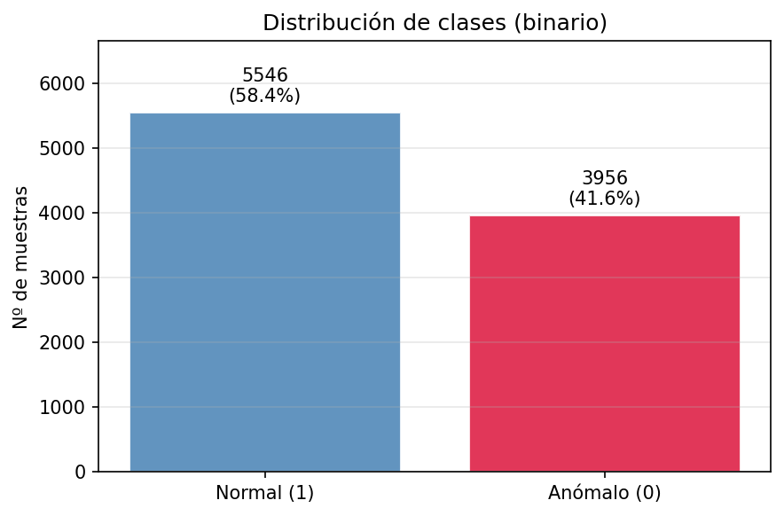
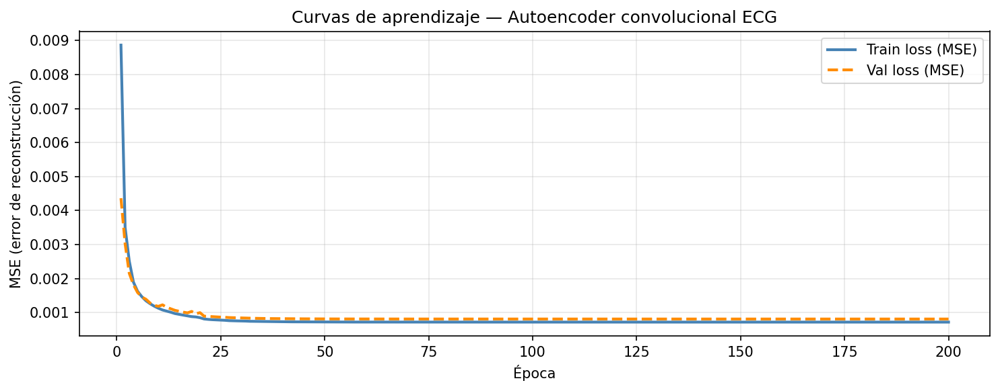
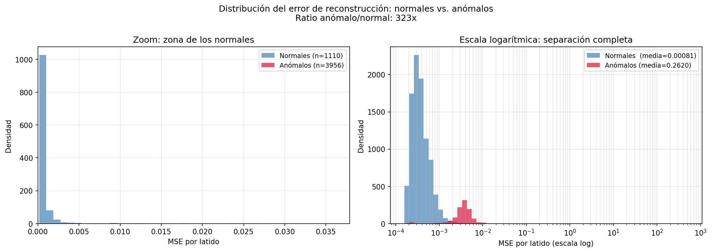
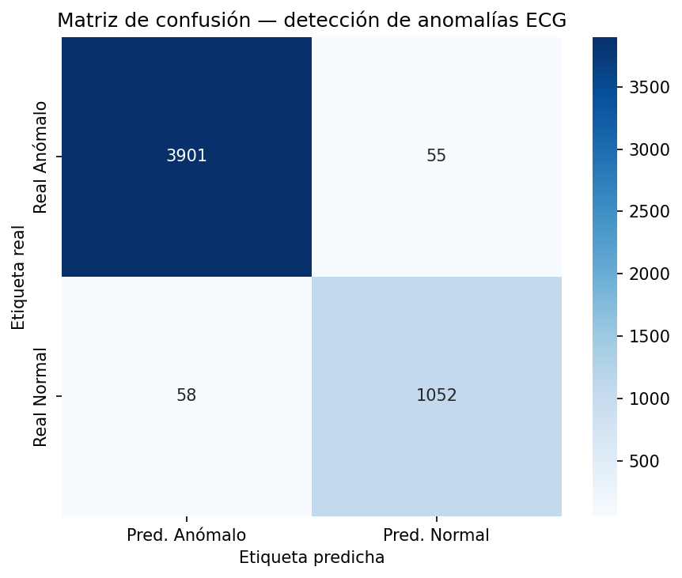
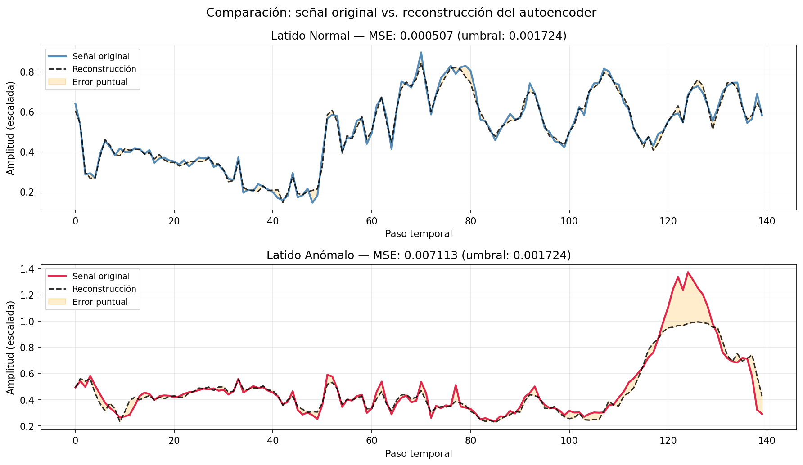

# ECG Anomaly Detection — Convolutional Autoencoder

**Unsupervised anomaly detection in cardiac signals using a Conv1D Autoencoder on ECG5000**

Academic project · Centro EUSA, Sevilla · 2025–2026

---

## Overview

Manual review of thousands of heartbeats by cardiologists is slow, costly and subjective. This project trains a convolutional autoencoder to detect anomalous heartbeats automatically — without using anomaly labels during training.

The core idea: train the model exclusively on normal heartbeats. When it then tries to reconstruct an anomalous beat (a pattern it has never seen), the reconstruction error rises sharply. That error is the anomaly signal.

This is not a traditional classifier. The model never learns what an anomalous beat looks like — only what a normal one looks like. The consequence is that **any morphology the encoder cannot compress efficiently is flagged as anomalous**, which generalises beyond the specific anomaly types present in the training data.

**Result:** Accuracy = **97.77%** · F1 (anomalies) = **0.986** · Recall (anomalies) = **98.6%** · Reconstruction error ratio (anomalous / normal) = **323×**

---

## Repository structure

```
ecg-anomaly-vae/
├── VAE_ECG_Anomaly.py      — full pipeline: data, training, evaluation
├── autoencoder_ecg.keras   — trained model (183 KB)
├── requirements.txt
└── output_figures/
    ├── fig1_muestras_por_clase.png
    ├── fig2_distribucion_clases.png
    ├── fig3_curvas_aprendizaje.png
    ├── fig4_distribucion_errores.png
    ├── fig5_distribucion_umbral.png
    ├── fig6_matriz_confusion.png
    └── fig7_reconstrucciones.png
```

---

## Dataset

**ECG5000** — UCR Time Series Classification Archive.

Available at the [UCR Archive](https://www.cs.ucr.edu/~eamonn/time_series_data_2018/) or via [Kaggle](https://www.kaggle.com/datasets/shayanfazeli/heartbeat). Download `ECG5000_train.csv` and `ECG5000_test.csv` and place them in an `ECG5000/` folder in the project root.

9,502 heartbeats, each represented as 140 time-series amplitude values. The original dataset has 5 classes; the project recodes them as a binary detection problem:

| Original class | Description | Recoded |
|:---:|---|:---:|
| 1 | Normal | 1 (Normal) |
| 2 | R on T | 0 (Anomalous) |
| 3 | PVC — Premature Ventricular Contraction | 0 (Anomalous) |
| 4 | SP — Paced Beat | 0 (Anomalous) |
| 5 | UB — Unclassifiable Beat | 0 (Anomalous) |

**Class distribution after recoding:** Normal 5,546 (58.4%) · Anomalous 3,956 (41.6%)



**Key preprocessing decisions:**

- **MinMaxScaler over StandardScaler:** ECG peaks (the QRS complex) are the most anomaly-relevant features. StandardScaler would suppress them; MinMaxScaler preserves them in [0, 1]. Some anomalous beats exceed [0, 1] after scaling — expected and welcome, as it is itself an anomaly signal.
- **Scaler fitted on normals only:** fitting on all data would let anomaly amplitudes influence the scaling statistics, introducing leakage.
- **Split by class, not stratified:** the autoencoder trains on 4,436 normal beats only. Validation uses 1,110 normals. Test uses all 5,066 beats (1,110 normal + 3,956 anomalous). Including anomalies in training would teach the model to reconstruct them, destroying its detection capacity.

---

## Model

**Convolutional Autoencoder — symmetric funnel architecture**

Conv1D over LSTM for this task because ECG beats have fixed length (140 steps) and local structure (the QRS complex, the P wave, the ST segment all occur at specific positions). Conv1D filters detect these local patterns by sliding along the signal; a dense layer would treat each of the 140 points independently, ignoring their temporal relationship.

| Layer | Type | Output shape | Parameters |
|---|---|---|---:|
| entrada | Input | (None, 140, 1) | 0 |
| enc_conv1 | Conv1D (32 filters, kernel 7) | (None, 140, 32) | 256 |
| enc_pool1 | MaxPooling1D (pool 2) | (None, 70, 32) | 0 |
| enc_conv2 | Conv1D (16 filters, kernel 7) | (None, 70, 16) | 3,600 |
| enc_pool2 | MaxPooling1D (pool 2) | (None, 35, 16) | 0 |
| enc_conv3 | Conv1D (8 filters, kernel 7) | (None, 35, 8) | 904 |
| latent space | MaxPooling1D (pool 2) | **(None, 18, 8)** | 0 |
| dec_conv1 | Conv1D (8 filters, kernel 7) | (None, 18, 8) | 456 |
| dec_up1 | UpSampling1D (×2) | (None, 36, 8) | 0 |
| dec_conv2 | Conv1D (16 filters, kernel 7) | (None, 36, 16) | 912 |
| dec_up2 | UpSampling1D (×2) | (None, 72, 16) | 0 |
| dec_conv3 | Conv1D (32 filters, kernel 7) | (None, 72, 32) | 3,616 |
| dec_up3 | UpSampling1D (×2) | (None, 144, 32) | 0 |
| salida | Conv1D (1 filter, sigmoid) | (None, 144, 1) | 225 |
| recorte | Cropping1D | (None, 140, 1) | 0 |
| **Total** | | | **9,969** |

The latent space compresses 140 time steps into 18 steps × 8 channels — less than 13% of the original length. The Cropping1D layer trims the 4 extra steps introduced by the UpSamplings to restore the original 140-point length. Output activation is sigmoid because the data is in [0, 1] after MinMaxScaling, keeping loss (MSE) and output range consistent.

### Training configuration

| Hyperparameter | Value |
|---|---|
| Loss / anomaly score | MSE (reconstruction error per sample) |
| Optimiser | Adam, lr = 0.001 |
| Batch size | 32 |
| Max epochs | 200 |
| Early stopping patience | 20 (gradual convergence requires more patience) |
| LR reduction patience | 5 (factor 0.5, min lr 1e-7) |
| Seed | 42 |

Training ran for the full 200 epochs without early stopping — the model continued improving very gradually until the end. The learning rate decreased progressively to 1e-7, indicating the optimiser found a very fine minimum. Final `val_loss`: 0.000811.



---

## Results

### Reconstruction error separation

| | Mean MSE |
|---|---|
| Normal beats | 0.000811 |
| Anomalous beats | 0.262002 |
| **Ratio** | **323×** |

Anomalous beats produce a reconstruction error 323 times larger than normal ones. The model learned the normal ECG morphology with high precision and fails consistently when trying to reconstruct patterns it has never seen.



### Detection threshold

The threshold is set at the **95th percentile of the reconstruction error on the normal training beats** (0.001724). Any beat with a higher error is classified as anomalous. The percentile is computed on the training set only — using the test set would be data leakage.

### Classification metrics

| Metric | Value |
|---|---|
| Accuracy | **97.77%** |
| F1 — Anomalous | **0.986** |
| Recall — Anomalous | **98.6%** |
| Precision — Anomalous | **98.5%** |
| False Negatives (anomalies missed) | 55 |
| False Positives (normals misclassified) | 58 |

Recall of 98.6% means the model detects 99 out of every 100 anomalous beats. In a clinical context, false negatives (anomalies missed) are the most critical error: a missed anomaly may lead to a delayed diagnosis. The 55 false negatives are a very low count given the dataset volume.



### Reconstruction visualisation



For a normal beat, the reconstruction is almost identical to the original. For an anomalous beat, the decoder attempts to "normalise" the signal towards the morphology it knows but fails — the visible residual between original and reconstruction translates directly into the high MSE that triggers detection.

---

## How to run

```bash
pip install -r requirements.txt

# Download ECG5000 and place ECG5000_train.csv and ECG5000_test.csv in ECG5000/
# The script uses relative paths (./ECG5000/) and runs without modification

python VAE_ECG_Anomaly.py
# Saves all figures to output_figures/ and the trained model to autoencoder_ecg.keras
```

> **Note:** The script installs dependencies automatically via `subprocess` if they are missing. If you prefer to manage your environment manually, install from `requirements.txt` first and the auto-install block will be skipped.

---

## Limitations

- **Variability between runs.** TensorFlow with parallel operations (oneDNN) does not guarantee perfect reproducibility across different runs even with the same seed. The detection threshold varies slightly between training runs, and given the high density of samples near the threshold boundary, small shifts can reclassify hundreds of beats. Metrics reported correspond to the best training run obtained.
- **Static threshold.** The threshold is computed once from training data. In production, if patient profiles or measurement equipment change, the error distribution may shift without warning.
- **Lab dataset.** ECG5000 comes from controlled simulations. Real clinical deployment would require validation with data from multiple centres, equipment types, and patient profiles.
- **No uncertainty estimation.** The model emits a binary label without confidence. A beat with error just at the threshold boundary receives the same treatment as one with an error ten times larger. MC Dropout or similar techniques would allow escalating borderline cases to human review.

---

## Academic context

Individual project · Centro EUSA, Sevilla · 2025–2026

Dataset: ECG5000 from the UCR Time Series Classification Archive (public domain).
