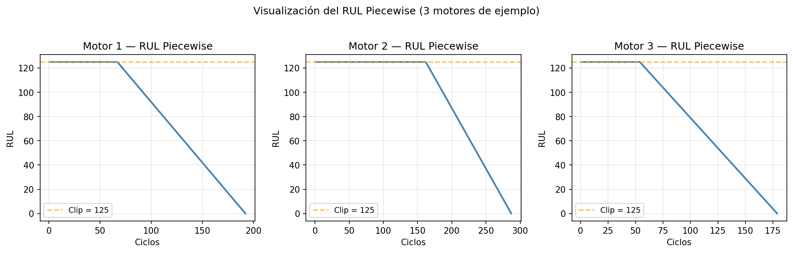
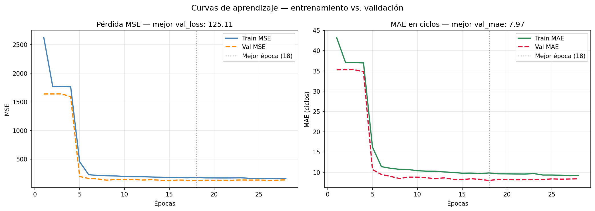
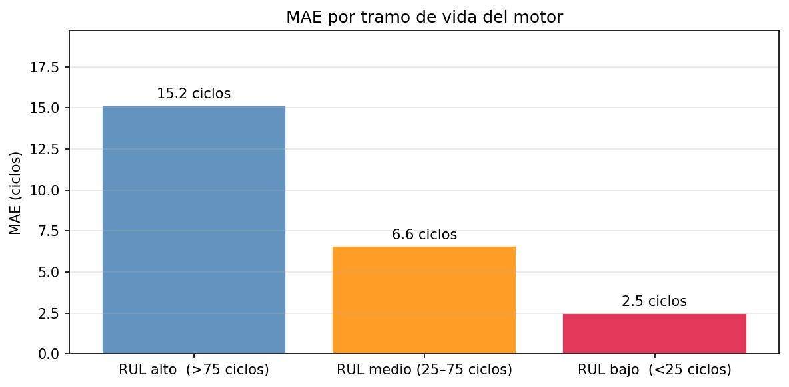

# Turbine RUL Prediction — Stacked LSTM

**Remaining Useful Life estimation for turbofan engines using LSTM on NASA C-MAPSS**

Academic project · Centro EUSA, Sevilla · 2025–2026

---

## Overview

Predictive maintenance (PdM) requires knowing not just *whether* a machine will fail, but *when*. This project frames the problem as a time-series regression task: given the sensor history of an aircraft turbofan engine, predict how many operating cycles it has left before failure (Remaining Useful Life, RUL).

The cost asymmetry is real: overestimating RUL (thinking the engine has more life than it does) can lead to catastrophic failure; underestimating it causes unnecessary maintenance stops, costly but safe. Under the EU AI Act (Regulation 2024/1689), a real deployment of this kind of system in aviation infrastructure would be classified as **high-risk AI**, requiring explainability, human oversight, and full technical documentation.

**Result:** RMSE = **14.42 cycles** · MAE = **10.36 cycles** · MAE in critical range (RUL < 25) = **2.50 cycles**

---

## Repository structure

```
turbine-rul-rnn/
├── train.py            — full training pipeline (Phases 1 & 2)
├── inference.py        — evaluation on test set (Phase 3)
├── requirements.txt
├── outputs/
│   ├── model.keras     — trained Stacked LSTM
│   ├── scaler.pkl      — fitted MinMaxScaler (must match inference)
│   ├── metadata.pkl    — preprocessing metadata (features, window size, RUL clip)
│   ├── history.pkl     — training history for re-plotting curves
│   └── figures/
│       ├── fig1_piecewise_rul.png
│       ├── fig2_correlacion_sensores.png
│       ├── fig3_curvas_aprendizaje.png
│       ├── fig4_trayectorias_degradacion.png
│       ├── fig5_analisis_residuos.png
│       └── fig6_mae_por_tramo.png
```

---

## Dataset

**NASA C-MAPSS FD001** — Commercial Modular Aero-Propulsion System Simulation.

Available at the [NASA Prognostics Data Repository](https://www.nasa.gov/content/prognostics-center-of-excellence-data-set-repository) or via [Kaggle](https://www.kaggle.com/datasets/behrad3d/nasa-cmaps). Download the three files (`train_FD001.txt`, `test_FD001.txt`, `RUL_FD001.txt`) and place them in a `cmapss/` folder in the project root.

FD001 simulates 100 turbofan engines under homogeneous flight conditions and a single failure mode. Each record contains 26 columns: 2 indices, 3 flight settings, and 21 sensor readings (temperatures, pressures, fan speeds). The training set contains full engine runs from start to failure; the test set contains runs truncated at a random point before failure, and the goal is to predict the RUL at that cut-off point.

**Key preprocessing decisions:**

- 7 constant-variance columns removed (`setting_3`, `s_1`, `s_5`, `s_10`, `s_16`, `s_18`, `s_19`) — sensors that never change carry no degradation signal.
- `s_14` removed — correlation ~1.0 with `s_9`, confirmed via heatmap.
- Outliers (IQR × 3) detected but **kept** — extreme readings in C-MAPSS are real physical degradation signals, not measurement errors.
- **Final feature set: 16 sensors.**

**Piecewise RUL target:** The raw RUL (max_cycle − current_cycle) is clipped at 125. Engines show no measurable degradation signal in early cycles; allowing RUL to reach 300–400 would force the network to learn a flat target with no supporting signal in the inputs. The clip makes the learning task tractable.



**Train / validation split:** 80 engines for training, 20 for validation — **split by engine, not by row**. Splitting by row would leak temporal information (early cycles of an engine mixed with its last cycles across splits), producing artificially optimistic validation metrics.

**Sliding window (50 cycles):** The LSTM processes sequences, not individual rows. A sliding window of 50 cycles generates 3D tensors of shape `(N, 50, 16)`. For the test set, only the last window of each engine is extracted (the closest to the cut-off point). 7 engines with fewer than 50 recorded cycles were discarded rather than zero-padded — zeros in sensor data are not "missing information", they would be interpreted by the LSTM as a real sensor reading.

| Split | Samples | Engines |
|---|---:|---:|
| Train | 12,859 windows | 80 |
| Validation | 2,872 windows | 20 |
| Test | 93 windows | 93 / 100 |

---

## Model

**Stacked LSTM — funnel topology (128 → 64 → 32 → 1)**

| Layer | Type | Units | Parameters |
|---|---|---:|---:|
| lstm_1 | LSTM + return_sequences | 128 | 74,240 |
| dropout_1 | Dropout 30% | — | 0 |
| lstm_2 | LSTM | 64 | 49,408 |
| dropout_2 | Dropout 30% | — | 0 |
| dense_hidden | Dense + ReLU | 32 | 2,080 |
| output | Dense + linear | 1 | 33 |
| **Total** | | | **125,761** |

Key design decisions: `return_sequences=True` in the first LSTM passes the full sequence to the second layer; the output activation is **linear** (not ReLU) — ReLU would block negative gradients and introduce a systematic bias towards high RUL values in a regression task.

### Training configuration

| Hyperparameter | Value |
|---|---|
| Loss | MSE (penalises large errors quadratically) |
| Metric | MAE (interpretable: cycles) |
| Optimiser | Adam, lr = 0.001 |
| Batch size | 32 |
| Max epochs | 100 |
| Early stopping patience | 10 (restores best weights) |
| LR reduction patience | 5 (factor 0.5, min lr 1e-6) |
| Seed | 42 |

Training stopped at **epoch 28** (best weights at **epoch 18**). The learning rate decreased progressively: 0.001 → 0.0005 (epoch 13) → 0.00025 (epoch 23).



---

## Results

| Metric | Value |
|---|---|
| RMSE | **14.42 cycles** |
| MAE | **10.36 cycles** |
| NASA Asymmetric Score | 281.62 |
| Mean bias | +3.22 cycles (slight underestimation) |
| Trainable parameters | 125,761 |
| Test engines evaluated | 93 / 100 |

The RMSE of 14.42 cycles is competitive: published LSTM results on C-MAPSS FD001 typically range between 11 and 16 cycles. The positive bias (+3.22 cycles) means the model tends to predict slightly less remaining life than the engine actually has — conservative and safe from a maintenance standpoint, though it generates some unnecessary early interventions.

The NASA Asymmetric Score (281.62) reflects the real cost structure of the problem: overestimating RUL is penalised more heavily than underestimating it.

**Performance by life stage:**

| Stage | N engines | MAE | RMSE | Bias |
|---|---:|---:|---:|---:|
| High RUL (> 75 cycles) | 50 | 15.15 | 18.68 | +5.62 |
| Medium RUL (25–75 cycles) | 24 | 6.58 | 8.34 | +0.71 |
| Low RUL (< 25 cycles) | 19 | **2.50** | **3.44** | +0.08 |

The model is most accurate where it matters most: in the critical window before failure (RUL < 25), MAE drops to 2.50 cycles. Higher error in the early stage is expected — degradation signals are weak and the Piecewise RUL clips the target to 125, making predictions in that range uniformly penalised.



---

## How to run

```bash
pip install -r requirements.txt

# 1. Download C-MAPSS FD001 and place the three .txt files in cmapss/
# 2. Open train.py and update BASE_PATH to point to your cmapss/ folder
#    (line 8 — the only line that needs changing)

# Train the model (generates all artefacts in outputs/)
python train.py

# Evaluate on the test set
# Also update BASE_PATH in inference.py (line 7)
python inference.py
```

> **Note on paths:** Both scripts use absolute Windows paths in the configuration block at the top (lines 7–14 in each file). These are the only lines that need updating to run on a different machine. All other paths are derived from these and require no changes.

---

## Limitations

- **Higher error in early life stage.** When RUL > 75, MAE rises to 15 cycles. The degradation signal is weak in early cycles and the Piecewise clip makes all high-RUL targets equivalent, reducing the learning signal.
- **Single failure mode, homogeneous conditions.** FD001 simulates constant flight conditions and one type of degradation. The model does not generalise to FD002, FD003 or FD004 (multiple failure modes, variable conditions), and would need retraining on representative data for a real deployment.
- **Point prediction without uncertainty.** The model outputs a single RUL value with no confidence interval. For a high-risk AI system under the EU AI Act, a probabilistic estimate (e.g. via MC Dropout or Deep Ensembles) would be required to flag unreliable predictions for human review.
- **Strict preprocessing dependency.** Inference requires the exact same scaler used during training (`scaler.pkl`). A sensor with different calibration in production would silently degrade performance.

---

## Academic context

Individual project · Centro EUSA, Sevilla · 2025–2026

Dataset: NASA C-MAPSS FD001 (public domain, NASA Prognostics Center).
